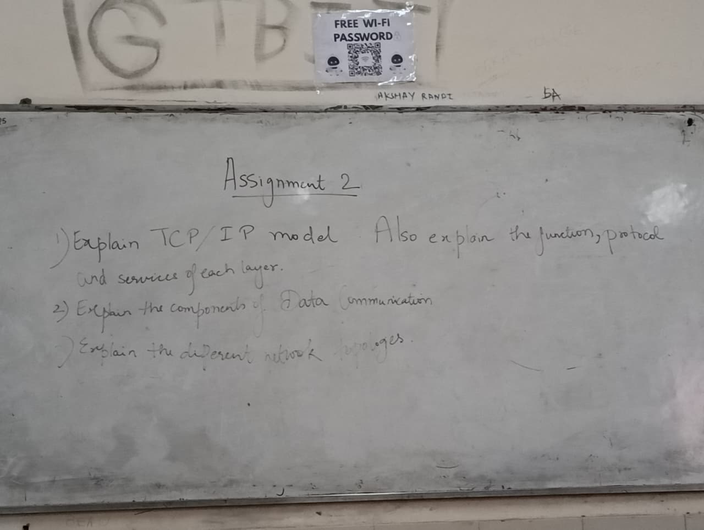
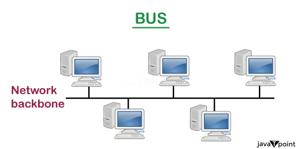
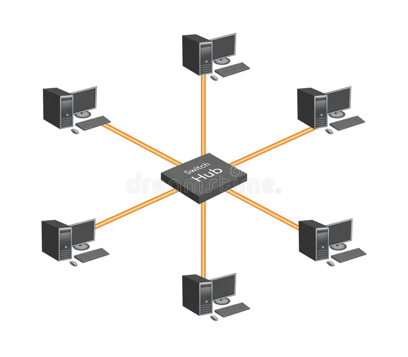
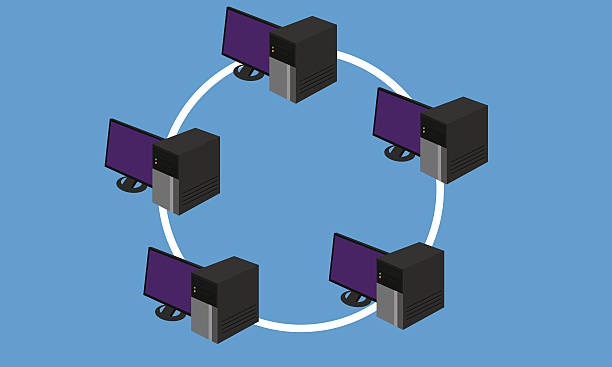
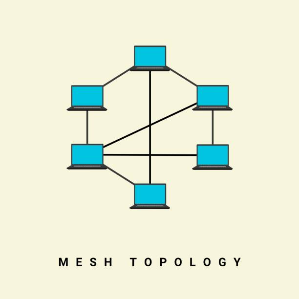
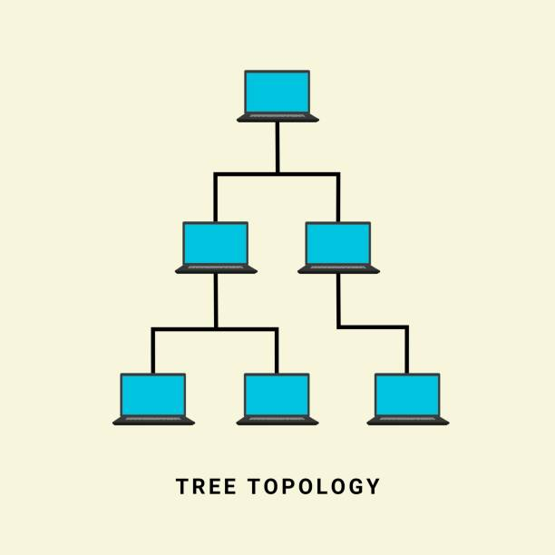
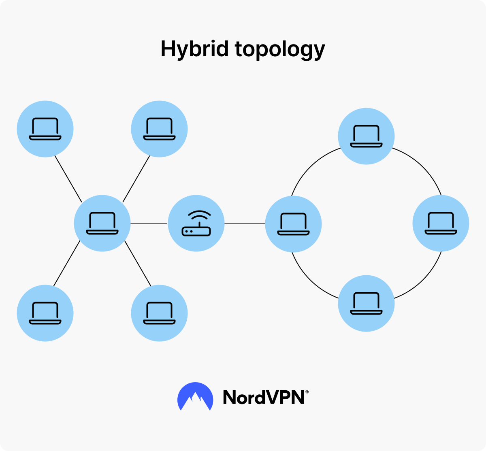

# Computer Networks Assignment - 2

## **QUESTION 1 : Explain the TCP/IP model. Also explain e function, protocol, and services of each layer.**

## **ANSWER 1 :**

### TCP/IP Model

### Introduction

- The **TCP/IP model** (Transmission Control Protocol / Internet Protocol) is a **4-layer architecture** used to design and implement computer networks.
- It is the foundation of the **Internet**.
- Developed by the U.S. Department of Defense (DoD) in the 1970s.
- Defines **how data is transmitted from source to destination across networks**.

**Layers of TCP/IP Model:**

1. Application Layer
2. Transport Layer
3. Internet Layer
4. Network Access Layer

### 1. Application Layer

#### Function:

- Provides **user services** and **network applications**.
- Defines how applications interact with the network.
- Responsible for **data representation, encoding, and dialogs**.

#### Protocols:

- **HTTP/HTTPS** → Web browsing
- **FTP** → File transfer
- **SMTP, IMAP, POP3** → Email services
- **DNS** → Domain name resolution
- **Telnet/SSH** → Remote login

#### Services:

- Supports user-level processes.
- Provides interfaces between applications and network.
- Enables data exchange between programs (browser, email client, etc.).

### 2. Transport Layer

#### Function:

- Ensures **end-to-end communication** between applications.
- Provides **error detection, reliability, and flow control**.
- Breaks data into **segments** (for TCP) or **datagrams** (for UDP).

#### Protocols:

- **TCP (Transmission Control Protocol)**
  - Connection-oriented, reliable, ordered data delivery.
  - Used in web browsing, email, file transfer.
- **UDP (User Datagram Protocol)**
  - Connectionless, faster, but unreliable.
  - Used in streaming, gaming, VoIP.

#### Services:

- Multiplexing and demultiplexing of data streams.
- Reliable delivery (TCP) or fast delivery (UDP).
- Error detection via checksums.

### 3. Internet Layer

#### Function:

- Responsible for **logical addressing, routing, and packet delivery**.
- Moves data packets across multiple networks from source to destination.

#### Protocols:

- **IP (Internet Protocol – IPv4, IPv6)** → Addressing & routing
- **ICMP (Internet Control Message Protocol)** → Error reporting (ping, traceroute)
- **ARP (Address Resolution Protocol)** → Maps IP to MAC addresses
- **RARP (Reverse ARP)** → Maps MAC to IP addresses

#### Services:

- Best-effort packet delivery (unreliable, connectionless).
- Logical addressing using IP addresses.
- Routing across networks.

### 4. Network Access Layer (Link Layer / Host-to-Network Layer)

#### Function:

- Defines how data is physically transmitted over the medium.
- Deals with **hardware addressing (MAC), framing, and access control**.
- Responsible for converting packets into **frames and bits**.

#### Protocols:

- **Ethernet** → Wired LAN
- **Wi-Fi (IEEE 802.11)** → Wireless LAN
- **PPP (Point-to-Point Protocol)** → Direct connections
- **Frame Relay, ATM** → WAN technologies

#### Services:

- Framing and error detection using checksums (CRC).
- Access control to the shared medium.
- Physical transmission of data (electrical signals, radio waves, optical signals).

---

## **QUESTION 2 : Explain the components of data communications.**

## **ANSWER 2 :**

### Components of Data Communications

Data communication is the **exchange of data between devices via a transmission medium**.  
The process requires several key components to ensure accurate and efficient communication.

### 1. Message

- The **information** to be communicated.
- Can be in the form of:
  - Text
  - Numbers
  - Pictures
  - Audio
  - Video

**Example:** An email, a file transfer, a voice call.

### 2. Sender

- The device or **source** that generates and transmits the message.
- Responsible for **encoding the message** into signals suitable for the transmission medium.

**Example:** Computer, smartphone, server.

### 3. Receiver

- The device that **receives the transmitted message**.
- Responsible for **decoding the signals** back into the original message.

**Example:** Another computer, smartphone, printer.

### 4. Transmission Medium

- The physical path or **channel through which the data travels** from sender to receiver.
- Can be:
  - **Guided media (wired)** → Twisted pair, coaxial, fiber optic
  - **Unguided media (wireless)** → Radio waves, microwaves, infrared

### 5. Protocol

- A **set of rules** that governs data communication.
- Ensures devices **understand each other** and data is transmitted accurately.

**Example:** TCP/IP for Internet, HTTP for web, FTP for file transfer.

### 6. Encoder/Decoder (Optional)

- **Encoder:** Converts the message into signals for transmission.
- **Decoder:** Converts received signals back into the original message.

**Example:** Modems, network interface cards (NICs).

### 7. Noise

- Any **unwanted signal or interference** that may distort the message during transmission.
- Can be:
  - Electrical interference
  - Crosstalk
  - Signal attenuation

**Impact:** May cause errors, requiring error detection and correction.

### 8. Destination

- The **final target** for the message, usually the same as the receiver.
- Ensures the **intended recipient gets the data accurately**.

---

## **QUESTION 3 : Explain the different network topologies.**

## **ANSWER 3 :**

### Network Topologies

Network topology refers to the **arrangement of devices (nodes) and connections (links) in a computer network**.  
It defines how data flows between devices and impacts performance, scalability, and fault tolerance.

#### 1. Bus Topology

- All devices are connected to a **single central cable** (bus or backbone).
- Data is sent in both directions along the bus; only the intended recipient accepts it.

**Characteristics:**

- Simple and cost-effective for small networks.
- Difficult to troubleshoot; a fault in the main cable affects all devices.
- Performance decreases with more devices.

**Diagram:**  
(click on the image to download it)  
(draw the diagram)

#### 2. Star Topology

- All devices are connected to a **central hub or switch**.
- Data passes through the hub to reach the destination device.

**Characteristics:**

- Easy to install and manage.
- Hub failure can affect the entire network (if hub is central).
- Better performance than bus due to dedicated connections.

**Diagram:**  
(click on the image to download it)  
(draw the diagram)

#### 3. Ring Topology

- Each device is connected to **two neighboring devices**, forming a closed loop.
- Data travels in **one or both directions** around the ring.

**Characteristics:**

- Data circulates in one direction (unidirectional) or both (bidirectional).
- Adding/removing devices can disrupt network unless using dual-ring.
- Token Ring protocol used to avoid collisions.

**Diagram:**  
(click on the image to download it)  
(draw the diagram)

#### 4. Mesh Topology

- Each device is connected to **every other device** directly.
- Provides **high redundancy and reliability**.

**Characteristics:**

- Very reliable; failure of one device doesn’t affect the network.
- Expensive and complex due to many connections.
- Used in WANs and critical networks.

**Diagram:**  
(click on the image to download it)  
(draw the diagram)

#### 5. Tree Topology

- Combination of **star and bus topology**.
- Groups of star-configured devices connected to a **main bus backbone**.

**Characteristics:**

- Hierarchical structure; easy to expand.
- Failure in backbone affects entire branch.
- Used in large networks (e.g., school or corporate networks).

**Diagram:**  
(click on the image to download it)  
(draw the diagram)

#### 6. Hybrid Topology

- Combination of **two or more topologies** to form a more complex network.
- Leverages advantages of multiple topologies and mitigates disadvantages.

**Characteristics:**

- Flexible and scalable.
- Design depends on requirements.
- Common in large enterprise networks.

**Diagram:**  
(click on the image to download it)  
(draw the diagram)

