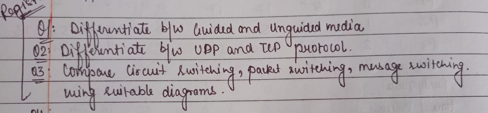
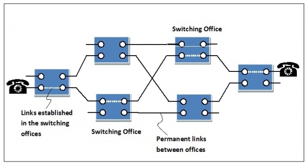
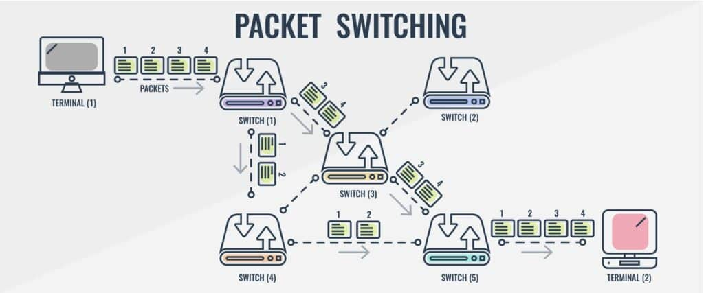
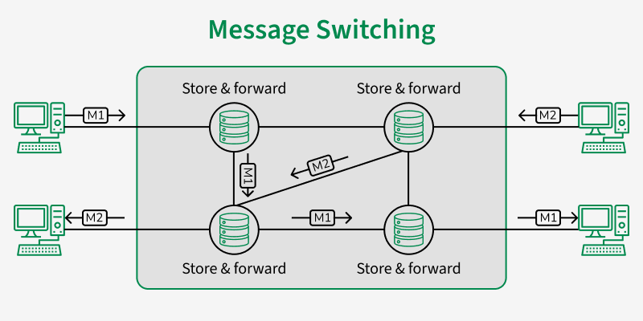

# Computer Networks Assignment - 1

## QUESTIONS

(click on the image to download it)

## **QUESTION 1 : Differentiate between guided and unguided media.**

## **ANSWER 1 : **

### 1. Guided Media

- Uses **physical paths** (cables/wires) to transmit signals.
- Transmission is **directed** and confined to the medium.
- Provides **higher security** and less interference compared to unguided media.
- Commonly used for **short and long distance communication**.

**Examples:**

- Twisted Pair Cable
- Coaxial Cable
- Optical Fiber

### 2. Unguided Media

- Uses **air or space as the medium**; no physical path is required.
- Transmission is done using **electromagnetic waves**.
- More prone to **interference, noise, and security issues**.
- Suitable for **wireless communication** and mobility.

**Examples:**

- Radio Waves
- Microwaves
- Infrared
- Satellite Communication

### Tabular Comparison

| Aspect           | Guided Media (Wired)                       | Unguided Media (Wireless)                 |
| ---------------- | ------------------------------------------ | ----------------------------------------- |
| **Definition**   | Transmission through physical cables       | Transmission through air/space            |
| **Medium**       | Copper wires, coaxial, optical fiber       | Radio, microwave, infrared, satellite     |
| **Direction**    | Signals confined to the path               | Signals propagate freely                  |
| **Speed**        | High (especially with fiber optics)        | Moderate to high (depends on technology)  |
| **Interference** | Less affected by external noise            | Highly affected by noise and obstacles    |
| **Security**     | More secure (physical access required)     | Less secure (signals can be intercepted)  |
| **Cost**         | Installation cost is higher (cabling)      | Generally lower (no cabling needed)       |
| **Examples**     | LAN cables, telephone lines, optical fiber | Wi-Fi, Bluetooth, Satellite, Mobile 4G/5G |

---

## **QUESTION 2 : Differentiate between UDP and TCP protocol.**

## **ANSWER 2 :**

### Difference between TCP and UDP Protocol

### 1. Transmission Control Protocol (TCP)

- Connection-oriented protocol (requires a connection before data transfer).
- Ensures **reliable, ordered, and error-checked delivery** of data.
- Provides **flow control and congestion control**.
- Slower than UDP due to overhead from reliability features.

**Examples of Usage:**

- Web browsing (HTTP/HTTPS)
- File Transfer Protocol (FTP)
- Email (SMTP, IMAP, POP3)

### 2. User Datagram Protocol (UDP)

- Connectionless protocol (no handshake or dedicated connection).
- **Unreliable and unordered** delivery (best-effort delivery).
- No flow control or congestion control.
- Faster than TCP due to low overhead.

**Examples of Usage:**

- Online gaming
- Video streaming (YouTube, Netflix)
- Voice over IP (VoIP)
- DNS queries

### Tabular Comparison

| Aspect                        | TCP (Transmission Control Protocol)        | UDP (User Datagram Protocol)        |
| ----------------------------- | ------------------------------------------ | ----------------------------------- |
| **Connection**                | Connection-oriented                        | Connectionless                      |
| **Reliability**               | Reliable (error detection, retransmission) | Unreliable (best-effort delivery)   |
| **Ordering**                  | Preserves order of packets                 | Does not preserve order             |
| **Error Checking**            | Yes, with retransmission if error detected | Yes, but no retransmission          |
| **Speed**                     | Slower due to reliability overhead         | Faster due to minimal overhead      |
| **Flow & Congestion Control** | Yes                                        | No                                  |
| **Header Size**               | 20–60 bytes                                | 8 bytes                             |
| **Examples of Usage**         | Web browsing, FTP, Email                   | Streaming, VoIP, Online gaming, DNS |

**Key Idea:**

- **TCP = Reliable and ordered delivery, heavier but accurate.**
- **UDP = Fast and lightweight, may lose packets, good for real-time applications.**

---

## **QUESTION 3 : Compare circuit switching, packet switching, message switching using suitable diagrams.**

## **ANSWER 3 :**

### 1. Circuit Switching

- Establishes a **dedicated communication path** between sender and receiver for the entire session.
- Data is transmitted as a **continuous stream**.
- Connection must be established before transmission and released after.
- **Example:** Traditional telephone network.

**Key Points:**

- Connection-oriented
- Fixed bandwidth
- Delay is minimal once the circuit is established
- Inefficient if the line is idle

**Diagram:**

(click on the image to download it)  
(draw the diagram)

## 2. Packet Switching

- Divides data into **small packets**, each with **destination address**.
- Packets are sent independently and may take **different routes** to the destination.
- Reassembled at the receiver.
- **Example:** Internet (IP networks).

**Key Points:**

- Connectionless or virtual connection
- Efficient bandwidth utilization
- Variable delay
- Reliable if error detection & retransmission mechanisms used

**Diagram:**

(click on the image to download it)  
(draw the diagram)  

## 3. Message Switching

- Entire message is treated as a **unit** and stored temporarily at intermediate nodes (store-and-forward) before forwarding.
- No dedicated path; each message routed independently.
- **Example:** Email systems, Telegram messages.

**Key Points:**

- Connectionless
- Store-and-forward approach
- Can introduce high delay for large messages
- Reliable if each node stores and forwards correctly

**Diagram:**

(click on the image to download it)  
(draw the diagram)

