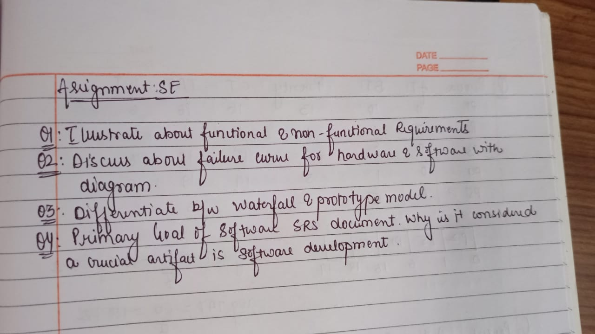
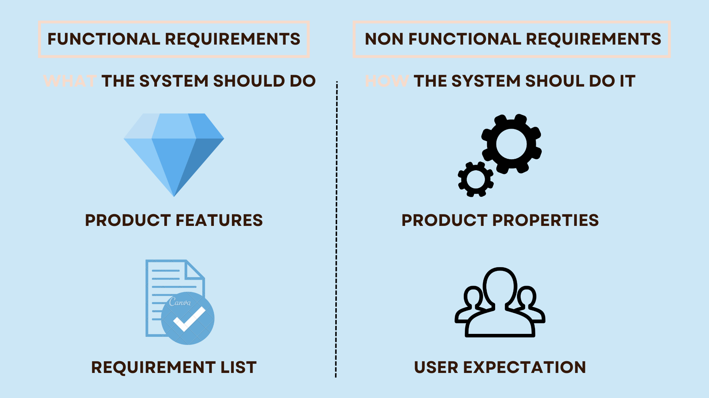
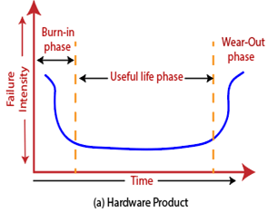
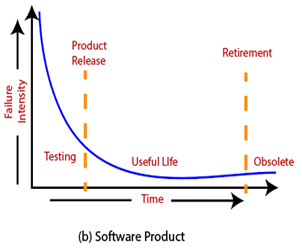

# Software Engineering Assignment - 1

---

## QUESTIONS

---

## **QUESTION 1 : Illustrate about the functional and non functional requirements.**

## **ANSWER 1 :**

1. Functional Requirements

   - Define **what the system should do**.
   - Describe the **specific features, functions, and behaviors** of the software.
   - Directly related to user interactions and system operations.
   - If functional requirements are not met → the system fails to perform its intended tasks.

   **Examples:**

   - User login/logout
   - Search functionality
   - Generating reports
   - Payment processing
   - Sending email notifications

2. Non-Functional Requirements (NFRs)

   - Define **how the system should perform**.
   - Describe the **quality attributes, constraints, and standards** of the software.
   - Related to performance, usability, reliability, and scalability.
   - If non-functional requirements are not met → system may still function, but poorly.

   **Examples:**

   - System should respond within **2 seconds** (performance).
   - Application should support **10,000 concurrent users** (scalability).
   - Data should be **encrypted** (security).
   - System should have **99.9% uptime** (reliability).
   - UI should be **user-friendly and accessible** (usability).

### Tabular Comparison

| Aspect             | Functional Requirements                         | Non-Functional Requirements                   |
| ------------------ | ----------------------------------------------- | --------------------------------------------- |
| **Definition**     | What the system should do                       | How the system should perform                 |
| **Focus**          | Features and behaviors                          | Quality attributes and constraints            |
| **Nature**         | Mandatory for system operation                  | Enhances system usability and performance     |
| **Examples**       | Login, search, generate reports, payment, email | Performance, security, scalability, usability |
| **Failure Impact** | System fails to deliver core functionality      | System works but may be inefficient/unusable  |
| **Expressed As**   | Actions, tasks, services                        | Quality attributes, conditions, constraints   |

---

## **QUESTION 2 : Discuss about failure curve about software and hardware with diagram.**

## **ANSWER 2 : Failure Curve of Software vs Hardware**

### 1. Hardware Failure Curve (Bathtub Curve)

Hardware components typically follow a **bathtub-shaped curve**:

1. **Early Failure Period (Infant Mortality):**

   - High failure rate at the beginning due to manufacturing defects, improper installation, or design flaws.
   - Failures decrease after defective units are removed.

2. **Useful Life Period:**

   - Failure rate becomes low and constant.
   - Most hardware operates reliably in this phase.

3. **Wear-Out Period:**
   - Failure rate rises again as components wear out due to aging, fatigue, or environmental stress.

**Key Idea:** Hardware failure depends on _physical degradation_ over time.

### 2. Software Failure Curve

- Software does not physically degrade like hardware.
- Its failure curve is different:

1. **Initial Phase:** High failure rate due to many undiscovered bugs when first deployed.
2. **Middle Phase:** As bugs are fixed through testing and patches, the failure rate decreases and stabilizes.
3. **Later Phase:** Unlike hardware, software does not wear out. Failures only increase if new updates introduce defects or if the software becomes incompatible with changing environments (OS, hardware, user needs).

**Key Idea:** Software failure depends on _design errors and bugs_, not physical aging.

### 3. Diagram (Representation)

---

## **QUESTION 3 : Differentiate between the Waterfall Model and Prototype Model.**

## **ANSWER 3 :**

### 1. Definition

- **Waterfall Model:** A linear sequential software development model where each phase (requirements → design → implementation → testing → deployment → maintenance) must be completed before moving to the next.
- **Prototype Model:** A trial-and-error approach where a working model (prototype) of the software is built to understand requirements better before the actual system is developed.

### 2. Process Flow

- **Waterfall:** Strict step-by-step flow, no overlapping phases.
- **Prototype:** Iterative process – prototype is refined repeatedly based on user feedback.

### 3. Requirements

- **Waterfall:** Requires well-defined, clear, and fixed requirements from the start.
- **Prototype:** Useful when requirements are unclear or frequently changing.

### 4. Flexibility

- **Waterfall:** Inflexible (hard to go back and change earlier phases).
- **Prototype:** Very flexible (requirements can be modified at any stage).

### 5. User Involvement

- **Waterfall:** Minimal user involvement (mostly during requirements and testing).
- **Prototype:** High user involvement (users evaluate prototypes and give feedback continuously).

### 6. Risk Handling

- **Waterfall:** High risk – errors in early stages may not be detected until later.
- **Prototype:** Lower risk – feedback from prototypes reduces chances of failure.

### 7. Time & Cost

- **Waterfall:** Usually less expensive if requirements are stable, but costly if changes are needed later.
- **Prototype:** May increase development cost/time due to multiple iterations but results in a better product.

### 8. Best Suitable For

- **Waterfall:** Small projects with clear, stable requirements (e.g., payroll system, government projects).
- **Prototype:** Large, complex, or innovative projects with unclear requirements (e.g., web applications, AI-based apps).

### Tabular Comparison

| Aspect               | Waterfall Model                | Prototype Model            |
| -------------------- | ------------------------------ | -------------------------- |
| **Approach**         | Linear, sequential             | Iterative, evolutionary    |
| **Requirement**      | Clear and fixed                | Unclear, evolving          |
| **Flexibility**      | Low                            | High                       |
| **User Involvement** | Minimal                        | Continuous                 |
| **Risk**             | High                           | Low                        |
| **Cost**             | Lower (if stable requirements) | Higher (due to iterations) |
| **Best For**         | Small, stable projects         | Complex, unclear projects  |

---

## **QUESTION 4 : Primary goal of software SRS document. Why it is considered a crucial artifact in software development.**

## ANSWER 4 :

### Primary Goal of a Software Requirements Specification (SRS) Document

- The primary goal of an SRS document is to **define, in detail, what the software system should do** – capturing all functional and non-functional requirements in a structured and precise manner.
- It acts as a **contract** between stakeholders (clients, users, management) and developers, ensuring that everyone has the same understanding of the system’s objectives, scope, and constraints.

### Why SRS is Considered a Crucial Artefact in Software Development

1. **Clarity and Shared Understanding**

   - Provides a single reference point for clients, developers, and testers.
   - Reduces ambiguity and misinterpretation of requirements.

2. **Foundation for Design & Development**

   - Serves as the blueprint for system architecture, design, coding, and testing.
   - Ensures developers build exactly what the client expects.

3. **Basis for Validation and Verification**

   - Test plans and cases are derived directly from the SRS.
   - Helps verify that the final product meets all documented requirements.

4. **Facilitates Communication**

   - Bridges the gap between technical teams and non-technical stakeholders.
   - Ensures everyone is aligned on scope and deliverables.

5. **Risk Reduction**

   - Identifies constraints, dependencies, and assumptions early.
   - Prevents costly rework by detecting requirement issues before development starts.

6. **Project Management Aid**
   - Acts as a baseline for cost estimation, scheduling, and resource allocation.
   - Helps track requirement changes during the project lifecycle.
     **Hence:**  
     The SRS is crucial because it ensures _“building the right product”_ by providing a clear, agreed-upon foundation that guides all later stages of the **Software Development Life Cycle (SDLC)**.

---
